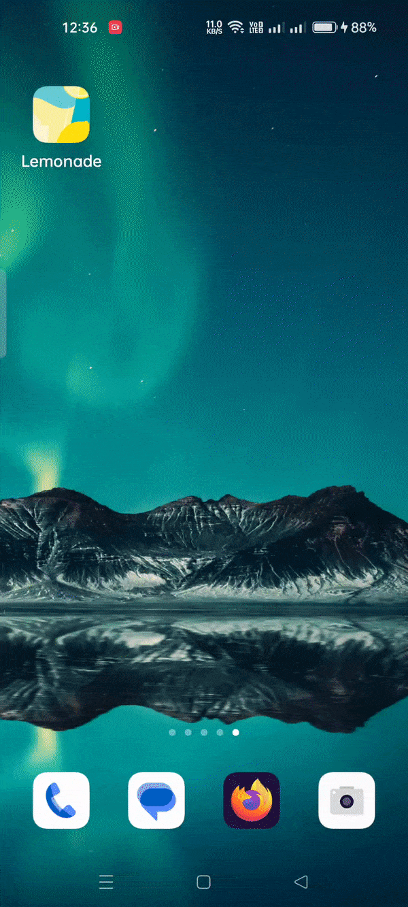

# Lemonade

## Introduction 
This lemonade app main concept is to serve glass of lemonade to you. while following you over a certain process.

## Behavior

- **A lemon tree will be displayed on main activity and a message will tell what to do**
- **After clicking on the lemon tree image it display a toastr that how many lemons needed to make lemonade**
- **After clicking multiple times when the squeezeCount will become equal to number of lemon need app will show greet word toastr**
- **Now app will show the lemonade glass image**
- **after clicking on the glass it will become empty and ask you restart or not?**

## Demonstration

{:style="display:block; margin-left:auto; margin-right:auto"}
